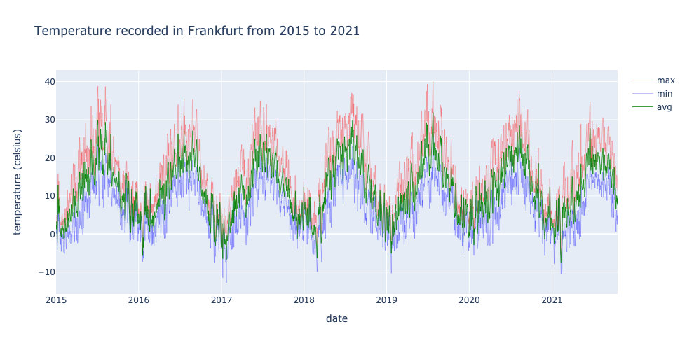

# TemperatureForecast
Forecasting temperature in Frankfurt, Germany, using past temperature data. Implementing an LSTM model in PyTorch.

## Fetching and Preprocessing Data

The data was acquired from [Meteostat](https://meteostat.net/en/), using their [API](https://rapidapi.com/meteostat/api/meteostat/). Their API fetches daily data pertaining to maximum, minimum and average temperature, as well as snowfall, rainfall, hours of sunlight, pressure, 
